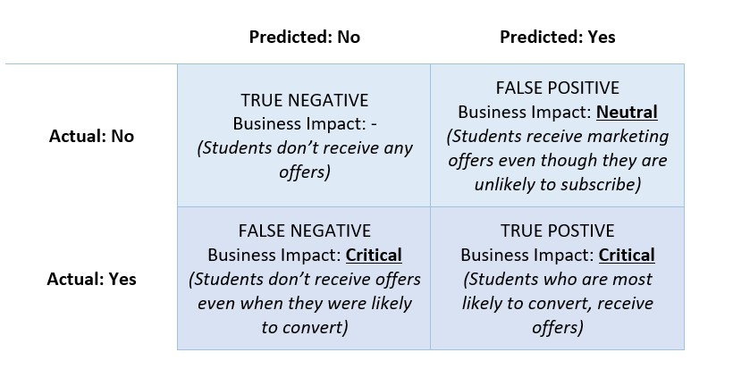

## Problem Statement

#### To develop a machine learning model to predict whether a free plan user would convert to a paid subscriber or not.

We have engagement data and subscription information for users of 365DataScience from 1st of Jan to 20th October 2022. Using this engagement data and subscription information (paid/free). we should develop a model that can predict if a new free user will pay and subscribe or not.

Features of interest are already extracted via SQL manipulation of interaction data (file attached). Moving to python, we will perform following steps - 

- Further exploratory data analysis or feature engineering (dimension reduction and standardization etc.)
- Train and Test split
- Balance the classes in case of imbalance
- Application of various models and method to analyze the best performance.

The (assumed) business purpose is to target and send customized offers to potential upgraders to convert to paid subscription. In that context, we should develop a model that minimizes false negatives since we dont want to miss opportunity to reach any perspective upgraders. Given focus on false negatives, its best to **pick a model with best RECALL.**

